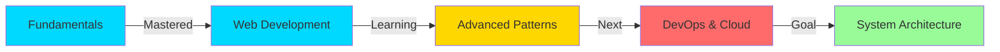

<!-- Animated Header -->
<div align="center">
  
</div>

<!-- Typing Animation -->
<p align="center">
  
</p>

<!-- Animated Snake -->
<div align="center">
  <picture>
    <source media="(prefers-color-scheme: dark)" srcset="https://raw.githubusercontent.com/dzikriii24/dzikriii24/output/github-contribution-grid-snake-dark.svg">
    <source media="(prefers-color-scheme: light)" srcset="https://raw.githubusercontent.com/dzikriii24/dzikriii24/output/github-contribution-grid-snake.svg">
    
  </picture>
</div>

<!-- Visitor Badge & Profile Views -->
<div align="center">
  
  
  
</div>

<br>

---

## 🙋‍♂️ About Me

```javascript
const dzikri = {
    location: "Bandung, Indonesia 🇮🇩",
    education: "Undergraduate in Informatics Engineering 🎓",
    currentFocus: "Building scalable web applications",
    interests: ["Web Development", "Problem Solving", "Open Source"],
    motto: "Code. Learn. Build. Repeat. 🔁",
    availableForWork: true,
    
    dailyRoutine: function() {
        return {
            morning: "☕ Coffee + Code",
            afternoon: "💻 Build & Debug",
            evening: "📚 Learn New Tech",
            night: "🌙 Side Projects"
        }
    }
};
```

<details>
<summary>📊 <b>More About My Coding Journey</b></summary>
<br>

- 🔭 Currently working on **Web-based mapping systems & digital agriculture solutions**
- 🌱 Learning **Go, Advanced React patterns, DevOps & Cloud technologies**
- 👯 Looking to collaborate on **open source projects & innovative web apps**
- 💬 Ask me about **Web Development, JavaScript, PHP, React, or anything tech!**
- ⚡ Fun fact: **I debug with console.log() and I'm not ashamed! 😄**
- 🎯 2024 Goals: **Contribute to open source, master Go & Docker, build 10+ projects**

</details>

---

## 🛠️ Tech Stack & Tools

### 💻 Languages
<div align="center">
  


</div>

### 🚀 Frameworks & Libraries
<div align="center">


</div>

### 🗄️ Databases & Backend
<div align="center">


</div>

### 🔧 Tools & Platforms
<div align="center">


</div>

---

## 🏆 Featured Projects

<div align="center">

| 🎯 Project | 💻 Tech Stack | 📝 Description | 🔗 Links |
|-----------|--------------|----------------|----------|
| **🗺️ KampEase** | PHP, JavaScript, MySQL, Tailwind CSS | Interactive web mapping system for universities with geolocation features | [Demo](#) |
| **💰 MOOOney-Laundrys** | Java Spring Boot, MySQL, Tailwind, HTML | Complete laundry management system with payment integration | [Demo](#) |
| **🌾 Tanduria** | PHP, Flask, MySQL, JavaScript, jQuery | Digital agriculture platform with real-time data synchronization | [Demo](#) |

</div>

<details>
<summary>🔍 <b>View More Projects</b></summary>
<br>

### Other Notable Projects:
- 🎮 **Game Portal** - React + Node.js gaming community platform
- 📊 **Analytics Dashboard** - Real-time data visualization with Chart.js
- 🛒 **E-Commerce API** - RESTful API with authentication & payment gateway
- 📱 **Portfolio Website** - Personal portfolio with modern animations
- 🔐 **Auth System** - Complete authentication system with JWT

</details>

---

## 📊 GitHub Statistics

<div align="center">
  
  
</div>

<div align="center">
  
</div>

### 📈 Contribution Graph
<div align="center">
  
</div>

### 🏆 GitHub Trophies
<div align="center">
  
</div>

---

## 💼 Experience & Learning

<details>
<summary>📚 <b>Current Learning Path</b></summary>
<br>



**📖 Currently Studying:**
- 🔹 Go programming & microservices architecture
- 🔹 Advanced SQL optimization & database design
- 🔹 React performance optimization & Next.js
- 🔹 Docker containerization & CI/CD pipelines
- 🔹 RESTful API design patterns & GraphQL
- 🔹 Testing frameworks (Jest, PHPUnit)
- 🔹 Cloud platforms (AWS/GCP basics)

</details>

<details>
<summary>🎯 <b>2024-2025 Goals</b></summary>
<br>

- ✅ Master Go programming language
- ⏳ Build 15+ production-ready projects
- ⏳ Contribute to 5+ open source projects
- ⏳ Learn Docker & Kubernetes
- ⏳ Get AWS/GCP certification
- ⏳ Write technical blog articles
- ⏳ Build a SaaS product from scratch

</details>

---

## 🎨 Coding Activity

<!--START_SECTION:waka-->
```text
JavaScript   12 hrs 30 mins  ████████████░░░░░   45.2%
PHP          8 hrs 15 mins   ████████░░░░░░░░░   29.8%
Go           3 hrs 45 mins   ███░░░░░░░░░░░░░░   13.5%
SQL          2 hrs 10 mins   ██░░░░░░░░░░░░░░░   7.8%
Other        1 hr 5 mins     █░░░░░░░░░░░░░░░░   3.7%
```
<!--END_SECTION:waka-->

---

## 🌐 Connect With Me

<div align="center">

[](https://instagram.com/sweswoz)
[](https://github.com/dzikriii24)
[](https://linkedin.com/in/dzikri-rabbani)
[](mailto:dzikrirabbani2401@gmail.com)
[](https://dzikrirabbani.dev)

</div>

---

## 💭 Quote of the Day

<div align="center">


</div>

---

## 🐍 Contribution Snake

<picture>
  <source media="(prefers-color-scheme: dark)" srcset="https://raw.githubusercontent.com/dzikriii24/dzikriii24/output/github-contribution-grid-snake-dark.svg">
  <source media="(prefers-color-scheme: light)" srcset="https://raw.githubusercontent.com/dzikriii24/dzikriii24/output/github-contribution-grid-snake.svg">
  
</picture>

---

## 📝 Latest Blog Posts
<!-- BLOG-POST-LIST:START -->
- 🚀 Getting Started with Go: A Beginner's Guide
- ⚡ React Performance Optimization Techniques
- 🐳 Docker for PHP Developers
- 💾 MySQL Query Optimization Best Practices
<!-- BLOG-POST-LIST:END -->

---

## ☕ Support My Work

<div align="center">

If you like my projects and want to support my work:

[](https://buymeacoffee.com/dzikrirabbani)
[](https://ko-fi.com/dzikrirabbani)

</div>

---

<div align="center">

### 💡 Random Dev Quote


### 😄 Random Dev Joke


</div>

---

## 📊 Additional Stats

<div align="center">
  
</div>

<div align="center">
  
  
</div>

---

<div align="center">

### 🎯 "Code is like humor. When you have to explain it, it's bad." - Cory House

**⭐ From [dzikriii24](https://github.com/dzikriii24) | Let's build something amazing together! 🚀**


</div>
